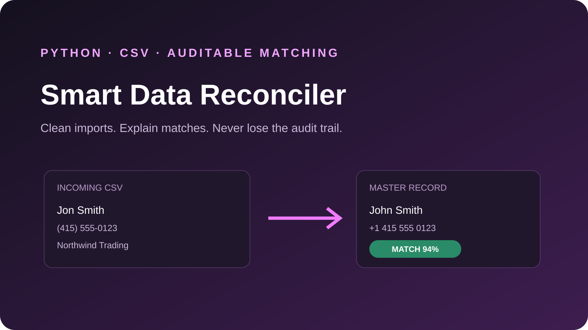

# Smart Data Reconciler

[](https://github.com/hexedb/smart-data-reconciler/actions)
[](https://python.org)



An auditable Python tool for matching a messy incoming CSV against a canonical customer database. It normalizes common data problems, ranks candidate matches, separates safe matches from ambiguous ones, and creates both machine-readable output and a human review report.

## The problem

CRM migrations and customer imports rarely have stable IDs. Names have typos or accents, phone numbers use different formats, legal company suffixes vary, and duplicate records may look equally plausible. A useful reconciliation pipeline must be conservative and explain **why** it linked two records.

## Features

- Unicode-aware name normalization
- International phone cleanup
- Case-insensitive email normalization
- Company legal-suffix removal
- Weighted exact and fuzzy field comparison
- Fast candidate blocking by normalized email and phone
- Ambiguity detection when the two best candidates are too close
- Explainable evidence for every decision
- CSV result, full JSON audit log and styled HTML report
- Standard-library-only runtime
- CLI, sample data and unit tests

## Quick start

```bash
python -m venv .venv
source .venv/bin/activate  # Windows: .venv\Scripts\activate
pip install -e ".[dev]"
reconcile-data sample_data/master.csv sample_data/incoming.csv --output output
```

Open `output/report.html` to review the results.

```text
Processed 4 rows: 3 matched, 0 need review, 1 unmatched.
Reports written to output
```

## Input schema

Both CSV files require these columns:

| Column | Example |
|---|---|
| `name` | `María García` |
| `email` | `maria@example.com` |
| `phone` | `+34 912 345 678` |
| `company` | `Contoso Limited` |

Extra columns are preserved in the JSON audit record.

## Decision model

The matcher combines available evidence:

- email exact match: 42%
- phone exact match: 33%
- name similarity: 18%
- company similarity: 7%

Weights are renormalized when a field is absent. A row is:

- `matched` when its score passes the threshold and clearly beats the second candidate;
- `ambiguous` when two candidates are too close;
- `unmatched` when evidence is insufficient.

Tune behavior without changing code:

```bash
reconcile-data master.csv incoming.csv \
  --threshold 0.82 \
  --ambiguity-margin 0.08 \
  --output output
```

## Outputs

- `reconciliation.csv` — compact operational result
- `audit.json` — complete source records, selected candidate, score and evidence
- `report.html` — readable review dashboard

The input files are never modified.

## Test

```bash
pytest -q
```

Tests cover Unicode, company suffixes, email/phone normalization, exact matches, fuzzy matches, unmatched records and ambiguous ties.

## Production extensions

For large datasets, replace the in-memory candidate lists with database indexes or MinHash/LSH blocking. Before automatic merges, calibrate thresholds on labeled historical data and require manual approval for ambiguous records.

## License

MIT
